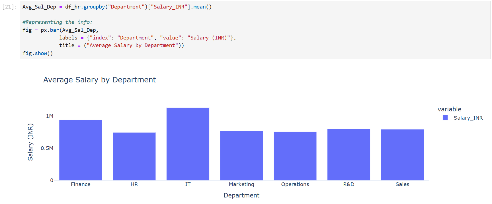
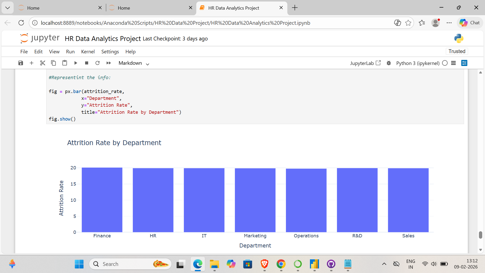

# HR Data Analytics Project

## Project Overview
This project analyzes employee data from a multinational company to uncover key HR insights such as:

- Attrition trends across departments  
- Salary distribution and top earners  
- Relationship between performance ratings and compensation  
- Department-level workforce patterns  

---

## Objectives
- Understand workforce attrition patterns  
- Explore salary structure across roles and departments  
- Analyze performance vs compensation trends  
- Generate actionable HR insights through visualizations  

---

## Dataset
The dataset contains employee-level HR information including:

- Department  
- Job Role  
- Monthly Income  
- Attrition Status  
- Performance Rating  
- Years at Company  

A small sample dataset is included for reference. The full dataset is not uploaded due to size limitations.

---

## Tools and Libraries Used
- Python  
- Pandas  
- NumPy  
- Matplotlib  
- Seaborn
- Plotly  

---

## Exploratory Data Analysis (Key Questions Answered)

This project explores the dataset through the following HR-focused business questions:

- Q1: What is the distribution of Employee Status (Active, Resigned etc)?
- Q2: How many employees are in each department?
- Q3: What is the average salary by department?
- Q4: What is the distribution of work modes?
- Q5: What is the average salary by job title?
- Q6: Which job title has the highest salary?
- Q7: How many employees resigned or were terminated in each department?
- Q8: How does salary vary with years of experience?
- Q9: What is the average performance rating by department?
- Q10: Which country has the highest concentration of employees?
- Q11: Is there a correlation between performance rating and salary?
- Q12: How has the number of hires changed over time (per year)?
- Q13: Compare salaries of remote vs onsite employees.
- Q14: Find the top employees with the highest salary in each department.
- Q15: Identify departments with the highest attrition rate.
 
## Visualizations and Key Business Questions

This project answers multiple HR-focused analytical questions through exploratory data analysis and visualizations.  
Below are two of the most impactful insights from the project:

---

### Q3: What is the Average Salary by Department?



This visualization compares the average monthly income across departments.  
It helps identify compensation patterns and highlights departments with higher or lower salary structures.

---

### Q15: Which Departments Have the Highest Attrition Rate?



This chart highlights departments experiencing the most employee turnover.  
Such insights are critical for HR teams to prioritize retention strategies and address workforce stability issues.

---

## Insights Generated

The analysis uncovered several important workforce and compensation trends, including:

- Noticeable differences in average salary levels across departments, indicating variation in role structure and pay distribution.  
- Departments with significantly higher attrition rates, suggesting areas where retention efforts and employee engagement strategies should be prioritized.  
- Clear workforce patterns at the department level, helping HR teams understand staffing concentration and turnover risk.  
- Compensation insights that support better decision-making around pay equity and departmental budgeting.  


---

## Project Structure

The repository is organized as follows:

```bash
hr-data-analytics-project/
│
├── HR Data Analytics Project.ipynb      # Main Jupyter Notebook with full analysis
├── Sample Data.xlsx                    # Sample dataset (full dataset not included)
│
├── images/                             # Folder containing visualization screenshots
│   ├── avg_salary_department.png
│   └── attrition_rate_department.png
│
├── README.md                           # Project documentation

---

## Author

**Vaibhav Adlakha**  
